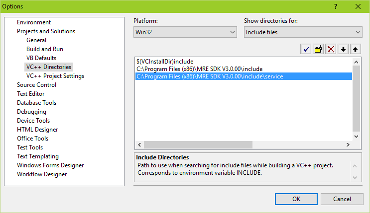
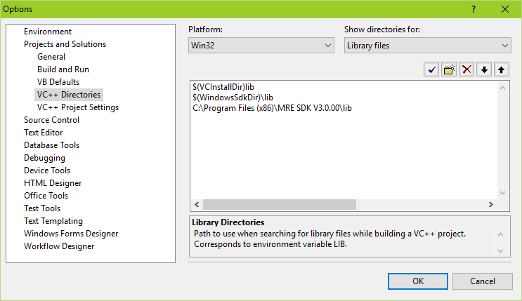
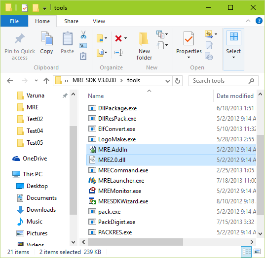
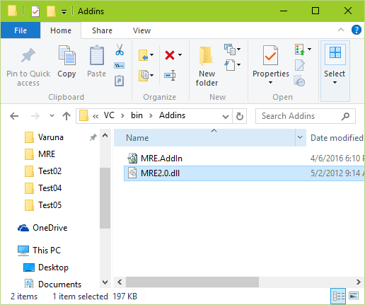
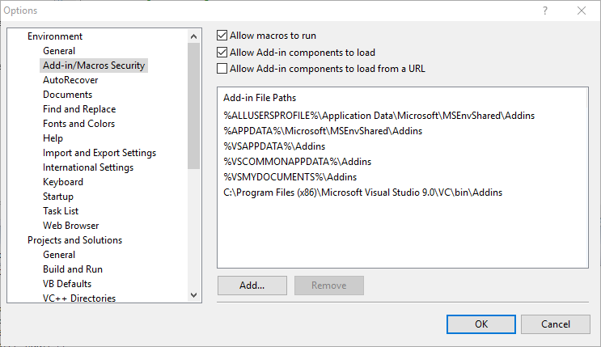
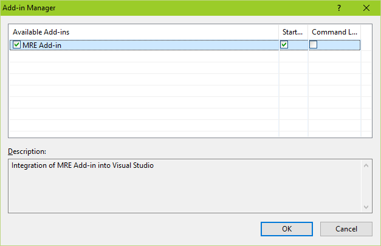
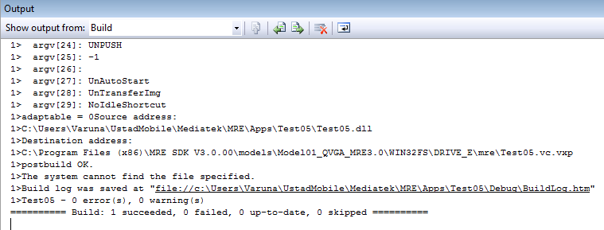
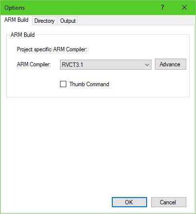
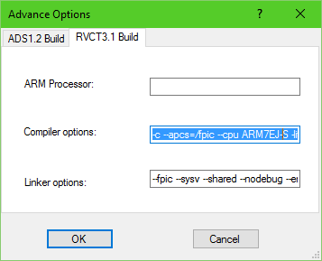

# Bitcoin MRE Wallet

#### Warning

No guarantees are provided about the safety of this app. I tried my best to ensure the PRNG is properly seeded and I have debugged and tested it as much as possible, but bugs do exists and could happen.
I do not take any responsibility from loss of funds or misuse of the app.
The app is open source and you can recompile it from scratch (please do, don't trust, verify).
Keep in mind that this is a hobby project and I strongly recommend (if you can afford it) using better hardware wallets (there are plenty out there: ColdCard, BlockStream Jade, Foundation Passport, Keystone Pro, Trezor Model T, Ledgers, etc.). 

#### Compiled apps

Mainnet: 
Testnet: 

#### Why?

Because it can run on cheap mass-market devices that do not require any assembling / firmware flashing or particular skills to install and run.
A Nokia 5310 2020 is sold for 15/20$, it has a keyboard, a screen, a SD card reader, a camera and it can run C code.

#### How to run it

Copy the vpx application into the SD Card and run it from the File Manager.

#### Entropy generation / randomness

I spent quite some time to ensure the entropy/randomness is decent.

Here is the source of entropy used:
- vm_che private key generation (Mediatek MRE crypto engine, no idea how safe it is)
- sha256 of 255 unicode keyboard inputs
- sha256 of operative system ticks
- sha256 of remaining space on phone and SDcard
- sha256 of microphone recording (it records less than a second, hash the result and delete the file) -> working on a real device, not working on the Win emulator
- sha256 of Photo folder (so take a bunch of pictures before starting the app)
- sha256 of a bunch of files on the SD card
- sha256 of imsi
- sha256 of imei
- sha256 of operator code

Once the seed is generated, chacha-drbg is used as CSPRNG.

#### How do I save the XPUB?

Open, recover or create a wallet, choose the derivation scheme, the optional passphrase and then "Save Public Info". It will create a file on the SD card with all the XPUBs that you can import on Specter for example.

Public keys will be saved in btc_mre_wallet/xpub/ (if using derivations) or btc_mre_wallet/pub/ (if using a single keypar).
Private keys will be saved in btc_mre_wallet/xpriv/ (if using derivations) or btc_mre_wallet/priv/ (if using a single keypar).
Do not save private keys on the SD Card unless you have a really good necessity. Wipe the SD Card properly after.

#### How do I create a PSBT?

I use a full Bitcoin Core node + Specter.
Move the PSBT inside the SD Card folder called: btc_mre_wallet/psbt/

#### Which PSBT format does it supports?

Raw, hex encoded and base64 encoded.

#### I have signed PSBT, how do I broadcast it?

First of all perform a Clean Exit (it will wipe BSS/Heap) and remove the battery for 1 minute to ensure data on the RAM is gone.

When you sign a PSBT, a base64 encoded PSBT is generated with the appended ".signed.psbt" extension.

To broadcast I use Bitcoin Core command line.

Fire up the daemon:
bitcoind --testnet

Then use the command line:
bitcoin-cli --testnet utxoupdatepsbt <base64_psbt>
bitcoin-cli --testnet finalizepsbt <utxoupdatepsbt_base64_psbt>
bitcoin-cli --testnet sendrawtransaction <finalizepsbt_raw_tx>

Done.

#### Wallet format

It's "proprietary". It uses some rudimental PBKDF2-style derivation + AES + redudancy/reed-solomon for error correction, so a bunch of random bit-flips will not make it unrecoverable.

#### Limitations

No bench32 address support.
No taproot support.
No camera/QRCode support (yet).
Many other smaller limitations.
Graphical glitches.
Word wrap is ugly.
Some actions don't have a graphical warning (e.g. wrong wallet password will just go back to text input, until you type the correct pass).

#### What I could do next (or not)

Fix word wrap.
Add camera and QRCode support.
Maybe switch to micropython+embit (easier to maintain, more features, etc.).
Broadcasting transactions via SMS (cool).

#### Quick notes of an MRE app

An MRE app can have access to file system, play media, draw 2D graphics with a 2D engine, has keyboard, touch and pen access, play audio, record, have access to Network with http, tcp socket support, have 5 levels of logging, parse xmls and has its own simulator.  Mediatek has today ended support for MRE and even its tools and discussions making it quite hard to develop for this platform. 

The file extension for an MRE App is .vxp and it is a binary executable file that runs on an phone that has a Mediatek chip and supports MRE applications. 

During development, an MRE application gets built for x86 based processors that can run on the MRE simulator on Windows. In order to get the same project built for an actual MRE application, there is another step where we "make" the application that gives a vxp file that can be executed on the Mediatek MRE capable phone. 

An MRE application structured is based around events. At the start of the application you attach event handlers to system, key and pen events. It seems you cannot change the handlers again once they are assigned. 	

#### Development Setup

You will need a Windows machine, Visual Studio 2008 is recommended and works the best (thats how old the documentation is) and have an ARM compiler (ADS1.2, RVCT3.1). I couldn't get GCC to cooperate. 

The next step is to Download Mediatek MRE's SDK  from [here](http://www.ustadmobile.com/mre/MRE_SDK_3.0.00.20_Normal_Eng_0.zip) (since Mediatek has removed any reference, discussion or tools relating to MRE) and install it. This SDK will make sure the necessary include header files for MRE SDK are available to be included in your project. This will also install a Wizard tool that will make you a demo application. The SDK also comes with a simulator and a Visual Studio 2008 toolbar that gets installed on to Visual Studio. 

Please install MRE_SDK into this path: C:\tools\MRE_SDK_V3

## Visual Studio Steps##

Get Visual Studio2008 / Visual C++ 2008 Express. Might work with newer versions but I haven't tried those.

Tools > Options> Projects and Solutions > VC++ Directories

$(VCInstallDir)include

C:\tools\MRE_SDK_V3\include

C:\tools\MRE_SDK_V3\include\service



 Library files: 

$(VCInstallDir)lib

$(WindowsSdkDir)\lib

C:\tools\MRE_SDK_V3\lib

 

 

Or edit the file in:

C:\Users\<username>\AppData\Local\Microsoft\VisualStudio\9.0\VCComponents.dat

In order to installthe "plugin" into Visual Studio:

Make a addin folder:

C:\Program Files(x86)\Microsoft Visual Studio 9.0\VC\bin\Addins

And copy the files :MRE.AddIn and MRE2.0.dll from C:\tools\MRE_SDK_V3\tools intothis folder

   

Then tell VisualStudio to look for Add Ins in that folder by going to:

VS2008>Tools>Options> Environment > Add-in/Macros Security 

Here"Add.." the Add in File Path 

 

Restart VisualStudio.

The go to :

VS2008 > Tools> Add-in Manager and you can see the MRE toolbar in there.

 

 

If you build via MRE toolbar it will make the vxp file. Also You need to start VS2008as Administrator because it needs access to Program Files / MRE folder.

 

#### Folder tree structure of the Project after compilation

< Project >

​	├───arm                        	#ARMcompilationoutput                        

         						#Hereis where the vxp/o file will be

​	├───config                        	#Definitionsand ALL Configs

​	│   		└───Default    	#compilation+ project config

​							#Madewhen compiled

​	├───Debug                 		#Buildoutput

​	├───res                          	#Resources,localisation, etc

​	└───ResID                      	#ResourceEdition

​		       ResID.h                  	#Resourceeditor generates this

​							#DefinesResources

​	│  config.xml                        	#Configfile (pre build)

​	│  custom_prebuild.bat 	#ResEditor stuff

​	│  mre_def.h                        	#definesMRE params 

​	│  Packagedll.bat                	#RunMRE DllPackage.exe after build

​							#andcopy vpp file to MoDis

​							#MoDisis the MRE Simulator.

​	│  TestProject.c               	#Themain C file (same as C++)

​	│  TestProject.cpp                #Themain C++ file (same as C)

​	│  TestProject.def               	#Declaresthe module parameters for 

​							#theDLL.

​	│  TestProject.h                	#Themain header file

​							#Doesnthave anything much

​							#Justdefines 

​	│  TestProject.sln                	#TheVisual Studio Solution

​	│  TestProject.vcproj        	#TheVisual C Project

​	│  TestProject.vcproj.user	#TheVisual C User Project

#### Brief application start and flow

Application starts with vm_main(void) function. This bit initialises a lot of the things: layer handle, register system events, keyboard event, pen events (not needed) and importantly the MRE resources. Then the function handle_sysevt(VMINT message, VMINT param) is called. The variable 'message' has value 4 and 'param' as 0. The variable message is 4 which is: VM_MSG_CREATE. This breaks

Then message becomes 1 which is VM_MSG_PAINT

​	This is to repaint the screen
​	It creates a base layer that has the same size as the screen
​	It then sets the graphic clip area
​	Uses: vm_graphic_get_screen_width() and height

Then calls: draw_hello() which contains commands to draw the text on screen.

#### Setting up ARM compiler 

SDK doesn'trecognize GCC then you'll have to get RVCT3.1, obtain a license and the SDK seems to be happy about that. 

RealViewDevelopment Suite 3.1  RVDS 3.1下载地址 [ARM Download link](https://silver.arm.com/download/Development_Tools/RVDS/RealView:_RVDS_deprecated/RVS31-BN-00000-r3p1-00rel0/RVS31-BN-00000-r3p1-00rel0.tgz)

You need to have a license to proceed further. Obtain it.

To access this, hit the Settings/Options button on the MRE toolbar in Visual Studio or in the MRE SDK 3.0 application (MRELauncher.exe) after opening and loading your project. 

  

```
	ARM Processor: ARM7EJ-S
	Compiler Options:-O2 --split_sections --cpu ARM7EJ-S -D__MRE_COMPILER_RVCT__ 
	Linker options: --fpic --sysv --entry rvct_entry --first rvct_entry

```

RVCT3.1 is a very old compiler and it only supports C89, so after spending days porting all the libraries to C89, I switched to Keil 5.18a that is using ARM Compiler 5.06 update 1 (build 61).
It requires a bunch of modifications to this ini file (C:\tools\MRE_SDK_V3\tools\sys.ini) and registry keys but it is fully compatible and it supports C99 and C++11.
Keil 5.18a / ARM Compiler 5.X require a license, but it is possible to find those files online:
- MDK518A.rar (the keygen included has a license until 2020, it's checking Win DLL installation date, so either you install Win on a VM with an old date, and keep using an old date, or use a newer keygen from MDK6)
- MDKCM518.EXE
- MDK79518.EXE
Got a keygen from MDK6 that has a longer expiration, but the Linker still doesn't like the license generated by the keygen, so I've fired up IDA Pro and cracked it by myself (a lot easier than obtaining those legacy licenses...)
It is also possible to use Sourcery CodeBench Lite for ARM EABI, but the standard libraries / libc are built for Posix and MRE doesn't have many of those, and it doesn't support sbrk (it uses OS allocations, e.g. vm_malloc instead of sbrk-based malloc).
So far Keil 5.18a / ARM Compiler 5.X works the best. Buy a license (if you can) or hit me up for help.

#### Debugging

To debug using Visual Studio, you can rename: BitcoinMRE.vcproj.DESKTOP-O7OUBIN.anon.user into BitcoinMRE.vcproj.<COMPUTER_NAME>.anon.user

Or you can set: "C:\tools\MRE_SDK_V3\models\Model01_QVGA_MRE3.0\MoDIS\Release\MoDIS.exe" as debug executable.

From the emulator go to the File Manager->SD Card->mre->BitcoinMRE.vpx->Install (you need to do it only once, there is no need to repeat this step when recompiling)

Then you can scroll the apps and on the last right tab there will be the app that you can start.

You can set breakpoints and debug the app.

#### Thx to

@StepanSnigirev
and many more
